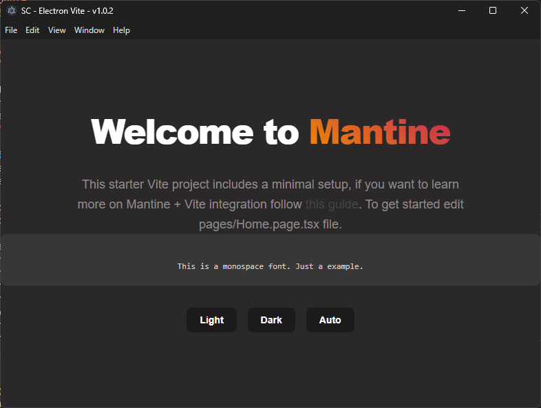

# Electron APP and Vite

> Type-safe Electron application with Vite, React 19, Mantine UI, and multi-page navigation

---

<div align="center">
  
  
</div>

<div align="center">
  
  
  
  
  
  
  
</div>

---

<!-- Badge Start -->
<div align="center">
 
 
 
 
 
</div>
<!-- Badge End -->

---



---

## ✨ Features

- **🎨 Modern UI**: Built with Mantine UI components and React 19
- **🚀 Multi-Page Navigation**: Demonstrates multiple screens with sidebar navigation
- **🔄 Theme Synchronization**: Bidirectional theme sync between system ↔ Electron ↔ Mantine
- **📁 File Operations**: Drag & drop and file system operations with type safety
- **⚡ Type-Safe IPC**: Typed inter-process communication using Zod schemas
- **🎯 Hot Reload**: Vite-powered development with fast refresh
- **📱 Responsive Design**: Adaptive layout that works on different screen sizes
- **🧩 Component Library**: Reusable components following Mantine patterns

### Available Pages

- **🏠 Home**: Welcome page with file operations and theme controls
- **🖼️ Gallery**: Image gallery with mock data and cards
- **💬 Messages**: Contact list with messaging interface
- **🔍 Search**: Search functionality with filtering
- **👤 Profile**: User profile management
- **⚙️ Settings**: App configuration with Mantine menu demo

---

## Help

- [Mantine](https://mantine.dev/)
- [Mantine Theme Editor - remoraid](https://remoraid.dev/)
- [Tabler Icons](https://tabler.io/icons) - Icon library used in the navigation

## Architecture Overview

This application follows a **modular architecture** with strict separation between frontend and backend processes:

- **Dual-Process Architecture**: Main process (`backend/`) and renderer process (`src/`) with typed IPC communication
- **Splash-to-Main Window Pattern**: Shows splash screen during initialization, then switches to main window
- **Typed IPC Contracts**: All IPC communication uses Zod schemas in `shared/ipc/contracts.ts`
- **Custom Hook Architecture**: Business logic encapsulated in reusable React hooks
- **Component-Based UI**: Modular components with Mantine UI library

## Getting Started

```bash
# Clone this repository
$ git clone https://github.com/saulotarsobc/electron-with-vite
# Go into the repository
$ cd electron-with-vite
# Install dependencies
$ npm install
# Run the app
$ npm run dev
```

---

## Available Scripts

- **dev**: Builds the Electron app and starts the development environment with hot reload
- **build**: Compiles TypeScript and builds both frontend and backend for production
- **dist**: Builds the application and packages it for distribution using electron-builder
- **preview**: Previews the built Vite application
- **postinstall**: Installs application dependencies using electron-builder
- **update-readme**: Updates the readme file using a script
- **generate-electron-builder**: Generates electron-builder configuration

### Development Workflow

```bash
npm run dev          # Vite dev server with Electron hot reload
npm run build        # TypeScript compilation + Vite build
npm run dist         # Full build + electron-builder packaging
```

---

## References

- [Electron Builder](https://www.electron.build/)
- [ElectronJS with NextJS](https://github.com/saulotarsobc/electronjs-with-nextjs)
- [Electron](https://www.electronjs.org/)
- [Vite](https://vite.dev/)
- [Como criar um app Electron usando Vite](https://dev.to/rafaelberaldo/como-criar-um-app-electron-usando-vite-52d6) - [@rfberaldo](https://github.com/rfberaldo)
